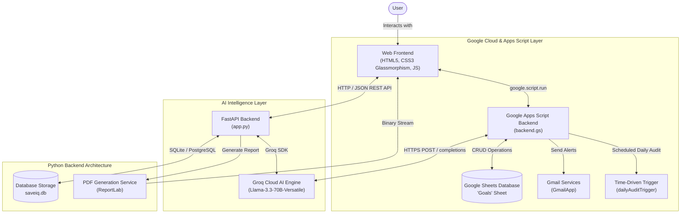

# SaveIQ – AI Savings Goal Tracker

> **AI-Powered Personal Finance & Savings Discipline Management System**  
> Built with Google Apps Script, Google Sheets Database, Groq Cloud AI (`llama-3.3-70b-versatile`), Gmail Services, and an optional FastAPI Python Microservice with PDF Reporting.

---

## 🌟 Overview

**SaveIQ** is an intelligent personal finance tracking platform designed to help users define savings goals, visualize portfolio progress, receive AI-driven financial coaching, and maintain disciplined saving habits through automated daily audits and email notifications.

### Key Scenarios Supported:
1. **Savings Goal Creation**: Define custom goals with target amount, initial savings, target completion deadline, notification email, and category.
2. **AI Financial Recommendations**: Receive instant, hyper-personalized financial pacing plans and behavioral expense-trimming hacks powered by **Groq Cloud (Llama-3.3-70B)**.
3. **Automated Deadline Audits & Gmail Alerts**: Scheduled background audits check for approaching deadlines (within 7 days) and overdue goals, automatically dispatching branded email alerts via Gmail.
4. **Financial Discipline Dashboard**: Real-time KPI analytics tracking Total Target, Total Saved, Portfolio Completion (%), Active Goals, Completed Milestones, and At-Risk / Overdue goals.

---

## 🏗️ System Architecture

SaveIQ provides a dual-deployment architecture:
1. **Cloud-Native Serverless Mode**: Deployed directly as a **Google Apps Script Web App** connected to **Google Sheets** and **Gmail Services**.
2. **FastAPI Microservice Mode**: Python backend with SQLite, ReportLab PDF generation, and Groq SDK (as visualized in the project architecture diagram).
3. **Client-Side Progressive Mode**: Standalone browser capability with direct Groq API client and local caching.



---

## 📁 Project Structure

```text
SaveIQ/
│── Index.html          # Main responsive glassmorphism web interface
│── backend.gs          # Google Apps Script controller, CRUD, AI & triggers
│── styles.css          # Modern glassmorphism stylesheet & responsive layout
│── styles.html         # Apps Script HTML template bundle for CSS
│── script.js           # Dynamic UI, backend bridge, analytics & AI logic
│── script.html         # Apps Script HTML template bundle for JS
│── app.py              # FastAPI Python backend with Groq & PDF generator
│── requirements.txt    # Python dependencies (FastAPI, Groq, ReportLab)
│── .env.example        # Environment variables template
│── appsscript.json     # Apps Script project manifest with OAuth scopes
│── README.md           # Full system documentation
└── assets/
    └── logo.svg        # SaveIQ vector brand asset
```

---

## 🚀 Deployment Guide: Google Apps Script Web App

### Step 1: Create Google Apps Script Project
1. Visit [script.google.com](https://script.google.com) and create a **New Project** named `SaveIQ – AI Savings Goal Tracker`.
2. In the Apps Script project editor, replace `Code.gs` with the contents of [`backend.gs`](file:///e:/Skill/backend.gs).
3. Create three HTML files by clicking **+ > HTML**:
   - `Index.html` (copy contents of [`Index.html`](file:///e:/Skill/Index.html))
   - `styles.html` (copy contents of [`styles.html`](file:///e:/Skill/styles.html))
   - `script.html` (copy contents of [`script.html`](file:///e:/Skill/script.html))

### Step 2: Configure Groq API Key
1. Go to [console.groq.com/keys](https://console.groq.com/keys) and generate an API key (e.g. `gsk_...`).
2. In Apps Script, open **Project Settings** (gear icon) > **Script Properties**.
3. Click **Add script property**:
   - **Property**: `GROQ_API_KEY`
   - **Value**: Your Groq API key.
4. *(Alternative)*: You can also enter your Groq API key directly into the **Settings modal (⚙️)** inside the running web app.

### Step 3: Configure Google Sheets Database
- By default, SaveIQ will automatically initialize a new Google Sheet named `SaveIQ – AI Savings Goal Tracker Database` with the `Goals` tab and required headers upon first run.
- If you have an existing spreadsheet, add its ID in **Script Properties** as `SPREADSHEET_ID`.

**Sheet Schema ("Goals"):**
| Column | Name | Description |
| :--- | :--- | :--- |
| **A** | `ID` | Unique Goal Identifier (e.g. `GID-8A2F9B10`) |
| **B** | `Goal Name` | Title (e.g., *Emergency Fund*, *M3 MacBook Pro*) |
| **C** | `Target Amount`| Target dollar amount |
| **D** | `Saved Amount` | Current cumulative deposited amount |
| **E** | `Deadline` | Target date (`YYYY-MM-DD`) |
| **F** | `Purpose` | Category (e.g., *Tech*, *Travel*, *Vehicle*) |
| **G** | `Created At` | Timestamp of goal creation |
| **H** | `Email` | User alert email address |
| **I** | `Alert Sent` | Audit tracking status (e.g., `Sent on 2026-09-30`) |

### Step 4: Setup Automated Daily Audit Trigger
1. In the Apps Script editor, select the function `setupDailyTrigger` from the function dropdown and click **Run**.
2. Grant the required permissions for Google Sheets, Gmail, and External Fetch when prompted.
3. The trigger is now active and will automatically execute `dailyAuditTrigger()` every morning at 8:00 AM.

### Step 5: Deploy Web App
1. Click **Deploy > New deployment**.
2. Click the gear icon next to "Select type" and choose **Web app**.
3. Set the following options:
   - **Description**: `SaveIQ Production v1.0`
   - **Execute as**: `Me (your Google account)`
   - **Who has access**: `Anyone` (or `Anyone with Google account`)
4. Click **Deploy**, authorize permissions, and copy the generated **Web App URL**.

---

## 🐍 Running with Python & FastAPI (Optional Local / Microservice Mode)

If you prefer to run the standalone Python backend shown in the architecture diagram:

### 1. Install Dependencies
```bash
pip install -r requirements.txt
```

### 2. Configure Environment
Create a `.env` file in the root directory:
```env
GROQ_API_KEY=your_groq_api_key_here
PORT=8000
```

### 3. Run FastAPI Server
```bash
python app.py
```
Or via Uvicorn:
```bash
uvicorn app:app --reload --port 8000
```

Open your browser to:
- **Web Interface**: `http://127.0.0.1:8000`
- **Interactive Swagger API Docs**: `http://127.0.0.1:8000/docs`
- **PDF Report Download**: `http://127.0.0.1:8000/api/reports/pdf`

---

## 🧪 Testing & Validation Suite

SaveIQ includes automated test functions to verify financial calculations, database operations, and AI integration:

### Google Apps Script Verification
Run `testCompleteWorkflow()` inside `backend.gs`:
1. **Initialize Database**: Ensures `Goals` sheet exists with formatted headers.
2. **Goal Creation**: Creates a test goal and generates unique ID.
3. **Financial Math**: Verifies remaining balance calculation `target - saved` and progress `%`.
4. **Deposit Handling**: Simulates deposit contribution and verifies new balance.
5. **Dashboard Analytics**: Checks aggregate KPI calculations.
6. **AI Insights**: Queries Groq API (or heuristic fallback) for recommendation.
7. **Cleanup**: Deletes test goal to keep the sheet pristine.

---

## 💡 Financial Calculation Logic Reference

- **Progress Percentage**:
  $$\text{Progress (\%)} = \min\left(\frac{\text{Saved Amount}}{\text{Target Amount}} \times 100, 100\right)$$
- **Remaining Amount**:
  $$\text{Remaining} = \max(\text{Target Amount} - \text{Saved Amount}, 0)$$
- **Days Remaining**:
  $$\text{Days Left} = \lceil (\text{Deadline Date} - \text{Today}) \rceil$$
- **Daily Required Savings Pace**:
  $$\text{Daily Required} = \frac{\text{Remaining Amount}}{\text{Days Left}} \quad (\text{if Days Left} > 0)$$
- **Weekly Required Savings Pace**:
  $$\text{Weekly Required} = \frac{\text{Remaining Amount}}{\text{Days Left} / 7}$$
- **Status Classification**:
  - `Completed`: If $\text{Saved Amount} \ge \text{Target Amount}$
  - `Overdue`: If $\text{Days Left} < 0$ and $\text{Saved Amount} < \text{Target Amount}$
  - `Active`: If $\text{Saved Amount} < \text{Target Amount}$ and $\text{Days Left} \ge 0$

---

## 🔒 Security & Privacy

- **API Keys**: Groq API Keys are stored safely in Google Apps Script `PropertiesService` (server-side) or `.env` files (never committed to Git).
- **OAuth Permissions**: Only the minimum scopes (`spreadsheets`, `gmail.send`, `script.external_request`) are requested in `appsscript.json`.
- **CORS & Data Isolation**: All client inputs are sanitized to prevent injection.
